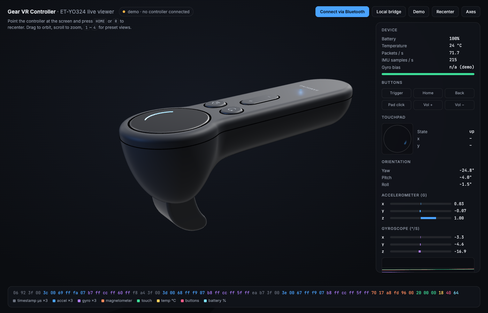

# Gear VR Controller, revived

The Samsung Gear VR Controller (ET-YO324 / SM-R324) was discontinued years ago.
This repo documents its Bluetooth LE protocol completely and puts the controller
back to work:

* **[PROTOCOL.md](PROTOCOL.md)**: the full BLE protocol, verified on hardware. It
  covers the command acknowledgement handshake that unlocks the 68 packets/s
  stream, the three IMU samples in each packet, calibrated axes and scales, the
  touchpad and button bits, and a hidden HID consumer-control channel.
* **`remote.py`**: use the controller as a gyro air-mouse, trackpad, and
  media/keyboard remote on macOS.
* **`viewer/`**: a three.js web viewer with a to-scale 3D model of the controller
  that mirrors the real one live, plus a byte-by-byte packet decoder.



## Setup

```sh
python3 -m venv .venv
.venv/bin/pip install -r requirements.txt
```

To let `remote.py` move the mouse, grant your terminal app **Accessibility**
permission (System Settings → Privacy & Security → Accessibility). Without it,
macOS silently drops the synthesized events.

## 3D viewer

Pick whichever of these suits you:

* **Chrome, no install:** open the hosted viewer at
  <https://dennisonbertram.github.io/gearvr-controller/viewer/> and click
  **Connect via Bluetooth**. It talks to the controller directly over Web Bluetooth.
* **Any browser:** run `.venv/bin/python bridge.py`. It connects to the controller
  and opens <http://localhost:8765>.
* **Alongside the remote:** run `.venv/bin/python remote.py --viewer` to drive the
  mouse and watch it in 3D at the same time.

Point the controller at the screen and press **Home** (or `R`) to recenter.
Keys `1`–`4` switch camera views and `A` shows the sensor axes. Without a
controller, the page runs a demo.

The controller accepts only one connection at a time, so use either Web
Bluetooth or the Python bridge, not both at once.

## Mac remote

```sh
.venv/bin/python remote.py            # mapping lives in config.toml
```

Default mapping:

* **Point and turn the controller** to move the cursor (gyro air-mouse)
* **Trigger** = left click (hold to drag), **touchpad click** = right click
* **Touchpad slide** = scroll while the air-mouse is on, trackpad-style cursor while it's off
* **Home** = air-mouse on/off, **Back** = Escape, **Volume ±** = system volume

Buttons can map to clicks, key combos (`key:cmd+[`), media keys, or shell
commands. The touchpad can also run in a swipe-gesture mode. When the air-mouse
starts, set the controller down for a second so it can calibrate the gyro. If
the controller falls asleep, press any button to wake it and `remote.py`
reconnects on its own.

> **Don't hold Home.** A long press wipes the controller's pairing, and macOS
> then refuses to connect until you *Forget This Device* in Bluetooth settings.

## Tools

| Command | What it does |
|---|---|
| `monitor.py` | live terminal view of the decoded buttons, touchpad, and IMU |
| `scan.py` / `explore.py` | find the controller / dump its GATT table |
| `capture.py 10 out.jsonl 0800 w2 0100` | raw packet logger with scripted commands |
| `guided.py` | voice-prompted capture session used to decode the protocol |
| `imu_cal.py`, `decode_guided.py`, `analyze.py`, `timeline.py` | the analysis scripts behind PROTOCOL.md |
| `python -m pytest -q` | decoder tests against recorded packets (in `caps/`) |

## Credits

This builds on earlier reverse-engineering work by
[jsyang](https://github.com/jsyang/gearvr-controller-webbluetooth),
[gb2111](https://github.com/gb2111/Access-GearVR-Controller-from-PC), and
[polygraphene](https://github.com/polygraphene/FreePIEVRController).
